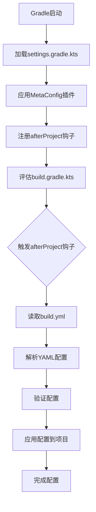

# Gradle 元配置插件 (Meta-Config Plugin)

[](https://plugins.gradle.org/plugin/com.d2rabbit.meta-config)
[](LICENSE)

这是一个强大的Gradle插件，允许通过`build.yml`文件来管理项目的仓库、依赖和基本信息配置，从而简化`build.gradle.kts`文件的复杂度，提高项目的可维护性和可读性。

## 🌟 功能特性

- ✅ **简化依赖管理**: 将`repositories`、`dependencies`和基本信息(`group`、`version`)的配置从KTS脚本中抽离
- ✅ **分离关注点**: 将"声明什么"与"如何实现"彻底分离，提升代码的组织性和可读性
- ✅ **保持灵活性**: 保留`build.gradle.kts`文件，用于处理更复杂的构建逻辑和插件声明
- ✅ **无缝集成**: 与现有Gradle生态系统和工具链完全兼容
- ✅ **YAML配置支持**: 使用直观的YAML格式管理项目配置
- ✅ **多仓库支持**: 支持Maven Central、Google、本地仓库和自定义URL仓库
- ✅ **全面依赖管理**: 支持所有标准Gradle依赖配置类型
- ✅ **文件变化检测**: 自动检测`build.yml`文件变化并重新加载配置
- ✅ **配置验证**: 提供完整的配置验证和错误提示

## 📁 项目结构

```
d2GradleSample/
├── build.gradle.kts                 # 插件构建脚本
├── settings.gradle.kts              # 根项目设置
├── src/main/kotlin/              # 插件源码
│   └── com/d2rabbit/gradle/
│       ├── MetaConfigPlugin.kt    # 插件主类
│       ├── config/                # 配置相关类
│       │   ├── BuildConfig.kt     # 配置数据结构
│       │   ├── YamlParser.kt      # YAML解析器
│       │   └── ConfigService.kt   # 配置服务
│       └── service/               # 服务类
│           ├── ProjectConfigurator.kt  # 项目配置器
│           └── FileChangeDetector.kt  # 文件变化检测器
└── ../test/                      # 测试项目(同级目录)
    ├── build.gradle.kts           # 简化的构建脚本
    ├── build.yml                  # 元配置文件
    ├── settings.gradle.kts        # 引用元配置插件
    └── src/main/kotlin/Main.kt
```

## 🚀 快速开始

### 1. 在项目中使用

要在您的项目中使用此插件，请按以下步骤操作：

1. 在项目的`settings.gradle.kts`中添加插件引用：
```kotlin
pluginManagement {
    repositories {
        mavenLocal()
        gradlePluginPortal()
        mavenCentral()
    }
}

plugins {
    id("com.d2rabbit.meta-config")
}

rootProject.name = "your-project-name"
```

2. 在项目根目录创建`build.yml`文件，用于声明项目配置：
```yaml
project:
  group: "com.example"
  version: "1.0.0"

repositories:
  - "mavenCentral"
  - "google"

dependencies:
  implementation:
    - "org.jetbrains.kotlin:kotlin-stdlib"
    - "com.google.code.gson:gson:2.10.1"
  testImplementation:
    - "org.jetbrains.kotlin:kotlin-test"
    - "org.junit.jupiter:junit-jupiter:5.9.2"
```

3. 在`build.gradle.kts`文件中声明插件并配置实现逻辑：
```kotlin
plugins {
    kotlin("jvm") version "2.2.20"
    application
}

// 注意：repositories {}, dependencies {} 块已被移至 build.yml

// --- 以下是实现和配置部分 ---

// 配置 application 插件
application {
    mainClass.set("com.example.MainKt")
}

// 配置 kotlin 插件
kotlin {
    jvmToolchain(21)
}

// 自定义任务
tasks.register("printConfig") {
    doLast {
        println("Project: $project")
        println("Group: ${project.group}, Version: ${project.version}")
    }
}

// 配置测试
tasks.test {
    useJUnitPlatform()
}
```

## 📖 配置参考

### 项目基本信息

```yaml
project:
  group: "com.example"      # 项目组ID
  version: "1.0.0"          # 项目版本
```

### 依赖仓库

```yaml
repositories:
  - "mavenCentral"           # Maven中央仓库
  - "mavenLocal"             # 本地Maven仓库
  - "google"                 # Google仓库
  - "gradlePluginPortal"     # Gradle插件门户
  - "https://repo.spring.io/release"  # 自定义Maven仓库
  - "https://jitpack.io"     # JitPack仓库
```

### 项目依赖

```yaml
dependencies:
  implementation:           # implementation依赖
    - "org.jetbrains.kotlin:kotlin-stdlib"
    - "com.google.code.gson:gson:2.10.1"
  api:                     # api依赖
    - "com.squareup.okhttp3:okhttp:4.12.0"
  compileOnly:             # compileOnly依赖
    - "javax.annotation:javax.annotation-api:1.3.2"
  runtimeOnly:             # runtimeOnly依赖
    - "org.slf4j:slf4j-simple:2.0.7"
  testImplementation:       # testImplementation依赖
    - "org.jetbrains.kotlin:kotlin-test"
    - "org.junit.jupiter:junit-jupiter:5.9.2"
  testApi:                 # testApi依赖
    - "com.squareup.okhttp3:mockwebserver:4.12.0"
  testCompileOnly:         # testCompileOnly依赖
    - "javax.annotation:javax.annotation-api:1.3.2"
  testRuntimeOnly:         # testRuntimeOnly依赖
    - "org.slf4j:slf4j-simple:2.0.7"
```

### 注意事项

目前插件专注于项目基本信息、仓库和依赖的配置管理。任务定义功能虽然在数据结构中已设计，但当前版本中尚未实现应用逻辑。如需定义自定义任务，请在`build.gradle.kts`文件中直接声明。

## 🔧 构建和测试

```bash
# 构建插件
./gradlew build

# 发布插件到本地Maven仓库
./gradlew publishToMavenLocal

# 测试示例项目
cd ../test
../d2GradleSample/gradlew build

# 运行示例项目
cd ../test
../d2GradleSample/gradlew run

# 运行自定义任务
cd ../test
../d2GradleSample/gradlew printConfig
```

## 🏗️ 架构设计

### 核心组件

1. **MetaConfigPlugin**: 插件主类，实现`Plugin<Settings>`接口
2. **YamlParser**: YAML解析器，负责将`build.yml`转换为Kotlin对象
3. **ConfigService**: 配置服务，提供配置加载和验证功能
4. **ProjectConfigurator**: 项目配置器，负责将配置应用到Gradle项目
5. **FileChangeDetector**: 文件变更检测器，支持开发时热重载

### 工作流程



### 配置策略

- **累加与覆盖**: 插件注入的配置与`build.gradle.kts`中的配置遵循Gradle的标准行为
  - `dependencies`是累加的
  - `group`和`version`的赋值会相互覆盖（以后者为准）
  - `repositories`也是累加的
  - 注意：插件声明仍然需要在`build.gradle.kts`中的`plugins {}`块中进行

## 🔄 文件变化检测

插件内置了文件变化检测功能，可以自动监控`build.yml`文件的变化：

1. **自动检测**: 每次构建时自动检查`build.yml`文件的修改时间
2. **热重载**: 检测到文件变化时自动重新加载配置
3. **状态记录**: 维护文件时间戳记录，避免不必要的重新加载
4. **日志记录**: 提供详细的加载和变化检测日志

## 🛠️ 开发状态

当前版本实现了完整的核心功能：

- ✅ YAML解析和验证
- ✅ 项目信息配置
- ✅ 仓库配置（包括自定义URL仓库）
- ✅ 依赖管理（支持所有标准配置类型）
- ✅ 文件变更检测（热重载）
- ✅ 错误处理和日志记录
- ✅ 示例项目
- ✅ 配置验证和错误提示

### 计划中的功能

- 🔄 任务定义支持（Copy、Exec、JavaExec、Delete、Sync等）
- 🔄 更多配置选项支持

## 🤝 贡献指南

我们欢迎社区贡献！请遵循以下步骤：

1. Fork 本仓库
2. 创建您的特性分支 (`git checkout -b feature/AmazingFeature`)
3. 提交您的更改 (`git commit -m 'Add some AmazingFeature'`)
4. 推送到分支 (`git push origin feature/AmazingFeature`)
5. 开启一个 Pull Request

### 开发环境设置

```bash
# 克隆仓库
git clone https://github.com/d2rabbit/gradle-meta-config-plugin.git
cd gradle-meta-config-plugin

# 构建项目
./gradlew build

# 运行测试
./gradlew test

# 发布到本地仓库（用于测试）
./gradlew publishToMavenLocal
```

## 📝 更新日志

### v1.0.0 (当前版本)
- 初始版本发布
- 支持基本的YAML配置管理
- 实现项目信息、仓库、依赖配置
- 实现文件变化检测
- 完整的配置验证和错误处理

## 📄 许可证

本项目采用MIT许可证。详情请参阅 [LICENSE](LICENSE) 文件。

## 🙏 致谢

项目有RooCode和Z-AI模型协助开发

## 📞 联系我们

- 项目主页: [GitHub](https://github.com/asdshuaishuai/metaConfigPlugin)
- 问题反馈: [Issues](https://github.com/asdshuaishuai/metaConfigPlugin/issues)
- 插件页面: [Gradle Plugin Portal](https://plugins.gradle.org/plugin/com.d2rabbit.meta-config)