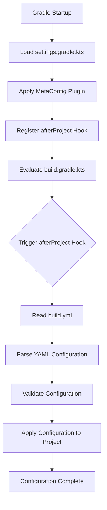

# Gradle Meta-Config Plugin

[](https://plugins.gradle.org/plugin/com.d2rabbit.meta-config)
[](LICENSE)

This is a powerful Gradle plugin that allows managing project repositories, dependencies, and basic information configuration through a `build.yml` file, simplifying the complexity of `build.gradle.kts` files and improving project maintainability and readability.

## 🌟 Features

- ✅ **Simplified Dependency Management**: Extracts configuration of `repositories`, `dependencies`, and basic information (`group`, `version`) from KTS scripts
- ✅ **Separation of Concerns**: Completely separates "what to declare" from "how to implement", enhancing code organization and readability
- ✅ **Maintains Flexibility**: Retains `build.gradle.kts` file for handling more complex build logic and plugin declarations
- ✅ **Seamless Integration**: Fully compatible with existing Gradle ecosystem and toolchain
- ✅ **YAML Configuration Support**: Uses intuitive YAML format for project configuration management
- ✅ **Multi-repository Support**: Supports Maven Central, Google, local repositories, and custom URL repositories
- ✅ **Comprehensive Dependency Management**: Supports all standard Gradle dependency configuration types
- ✅ **File Change Detection**: Automatically detects `build.yml` file changes and reloads configuration
- ✅ **Configuration Validation**: Provides complete configuration validation and error reporting

## 📁 Project Structure

```
d2GradleSample/
├── build.gradle.kts                 # Plugin build script
├── settings.gradle.kts              # Root project settings
├── src/main/kotlin/              # Plugin source code
│   └── com/d2rabbit/gradle/
│       ├── MetaConfigPlugin.kt    # Plugin main class
│       ├── config/                # Configuration related classes
│       │   ├── BuildConfig.kt     # Configuration data structures
│       │   ├── YamlParser.kt      # YAML parser
│       │   └── ConfigService.kt   # Configuration service
│       └── service/               # Service classes
│           ├── ProjectConfigurator.kt  # Project configurator
│           └── FileChangeDetector.kt  # File change detector
└── ../test/                      # Test project (sibling directory)
    ├── build.gradle.kts           # Simplified build script
    ├── build.yml                  # Meta-configuration file
    ├── settings.gradle.kts        # Reference to meta-config plugin
    └── src/main/kotlin/Main.kt
```

## 🚀 Quick Start

### 1. Using in Your Project

To use this plugin in your project, follow these steps:

1. Add plugin reference in your project's `settings.gradle.kts`:
```kotlin
pluginManagement {
    repositories {
        mavenLocal()
        gradlePluginPortal()
        mavenCentral()
    }
}

plugins {
    id("com.d2rabbit.meta-config")
}

rootProject.name = "your-project-name"
```

2. Create a `build.yml` file in the project root directory for declaring project configuration:
```yaml
project:
  group: "com.example"
  version: "1.0.0"

repositories:
  - "mavenCentral"
  - "google"

dependencies:
  implementation:
    - "org.jetbrains.kotlin:kotlin-stdlib"
    - "com.google.code.gson:gson:2.10.1"
  testImplementation:
    - "org.jetbrains.kotlin:kotlin-test"
    - "org.junit.jupiter:junit-jupiter:5.9.2"
```

3. Declare plugins and configure implementation logic in `build.gradle.kts`:
```kotlin
plugins {
    kotlin("jvm") version "2.2.20"
    application
}

// Note: repositories {}, dependencies {} blocks have been moved to build.yml

// --- Implementation and configuration part ---

// Configure application plugin
application {
    mainClass.set("com.example.MainKt")
}

// Configure kotlin plugin
kotlin {
    jvmToolchain(21)
}

// Custom task
tasks.register("printConfig") {
    doLast {
        println("Project: $project")
        println("Group: ${project.group}, Version: ${project.version}")
    }
}

// Configure tests
tasks.test {
    useJUnitPlatform()
}
```

## 📖 Configuration Reference

### Project Basic Information

```yaml
project:
  group: "com.example"      # Project group ID
  version: "1.0.0"          # Project version
```

### Dependency Repositories

```yaml
repositories:
  - "mavenCentral"           # Maven Central Repository
  - "mavenLocal"             # Local Maven Repository
  - "google"                 # Google Repository
  - "gradlePluginPortal"     # Gradle Plugin Portal
  - "https://repo.spring.io/release"  # Custom Maven Repository
  - "https://jitpack.io"     # JitPack Repository
```

### Project Dependencies

```yaml
dependencies:
  implementation:           # implementation dependencies
    - "org.jetbrains.kotlin:kotlin-stdlib"
    - "com.google.code.gson:gson:2.10.1"
  api:                     # api dependencies
    - "com.squareup.okhttp3:okhttp:4.12.0"
  compileOnly:             # compileOnly dependencies
    - "javax.annotation:javax.annotation-api:1.3.2"
  runtimeOnly:             # runtimeOnly dependencies
    - "org.slf4j:slf4j-simple:2.0.7"
  testImplementation:       # testImplementation dependencies
    - "org.jetbrains.kotlin:kotlin-test"
    - "org.junit.jupiter:junit-jupiter:5.9.2"
  testApi:                 # testApi dependencies
    - "com.squareup.okhttp3:mockwebserver:4.12.0"
  testCompileOnly:         # testCompileOnly dependencies
    - "javax.annotation:javax.annotation-api:1.3.2"
  testRuntimeOnly:         # testRuntimeOnly dependencies
    - "org.slf4j:slf4j-simple:2.0.7"
```

### Notes

Currently, the plugin focuses on project basic information, repository, and dependency configuration management. Although task definition functionality is designed in the data structure, the application logic is not yet implemented in the current version. To define custom tasks, please declare them directly in the `build.gradle.kts` file.

## 🔧 Building and Testing

```bash
# Build plugin
./gradlew build

# Publish plugin to local Maven repository
./gradlew publishToMavenLocal

# Test sample project
cd ../test
../d2GradleSample/gradlew build

# Run sample project
cd ../test
../d2GradleSample/gradlew run

# Run custom task
cd ../test
../d2GradleSample/gradlew printConfig
```

## 🏗️ Architecture Design

### Core Components

1. **MetaConfigPlugin**: Plugin main class implementing `Plugin<Settings>` interface
2. **YamlParser**: YAML parser responsible for converting `build.yml` to Kotlin objects
3. **ConfigService**: Configuration service providing configuration loading and validation functionality
4. **ProjectConfigurator**: Project configurator responsible for applying configuration to Gradle project
5. **FileChangeDetector**: File change detector supporting hot reload during development

### Workflow



### Configuration Strategy

- **Accumulation and Override**: Plugin-injected configurations and configurations in `build.gradle.kts` follow Gradle's standard behavior
  - `dependencies` are accumulative
  - `group` and `version` assignments override each other (latter prevails)
  - `repositories` are also accumulative
  - Note: Plugin declarations still need to be done in the `plugins {}` block in `build.gradle.kts`

## 🔄 File Change Detection

The plugin includes built-in file change detection functionality that automatically monitors changes to the `build.yml` file:

1. **Automatic Detection**: Automatically checks for modifications to the `build.yml` file on each build
2. **Hot Reload**: Automatically reloads configuration when file changes are detected
3. **State Recording**: Maintains file timestamp records to avoid unnecessary reloading
4. **Logging**: Provides detailed loading and change detection logs

## 🛠️ Development Status

The current version implements complete core functionality:

- ✅ YAML parsing and validation
- ✅ Project information configuration
- ✅ Repository configuration (including custom URL repositories)
- ✅ Dependency management (supports all standard configuration types)
- ✅ File change detection (hot reload)
- ✅ Error handling and logging
- ✅ Sample project
- ✅ Configuration validation and error reporting

### Planned Features

- 🔄 Task definition support (Copy, Exec, JavaExec, Delete, Sync, etc.)
- 🔄 More configuration options support

## 🤝 Contribution Guidelines

We welcome community contributions! Please follow these steps:

1. Fork this repository
2. Create your feature branch (`git checkout -b feature/AmazingFeature`)
3. Commit your changes (`git commit -m 'Add some AmazingFeature'`)
4. Push to the branch (`git push origin feature/AmazingFeature`)
5. Open a Pull Request

### Development Environment Setup

```bash
# Clone repository
git clone https://github.com/d2rabbit/gradle-meta-config-plugin.git
cd gradle-meta-config-plugin

# Build project
./gradlew build

# Run tests
./gradlew test

# Publish to local repository (for testing)
./gradlew publishToMavenLocal
```

## 📝 Changelog

### v1.0.0 (Current Version)
- Initial release
- Support for basic YAML configuration management
- Implementation of project information, repository, and dependency configuration
- Implementation of file change detection
- Complete configuration validation and error handling

## 📄 License

This project is licensed under the MIT License. See the [LICENSE](LICENSE) file for details.

## 🙏 Acknowledgements

Project developed with assistance from RooCode and Z-AI models

## 📞 Contact Us

- Project Homepage: [GitHub](https://github.com/asdshuaishuai/metaConfigPlugin)
- Issue Reporting: [Issues](https://github.com/asdshuaishuai/metaConfigPlugin/issues)
- Plugin Page: [Gradle Plugin Portal](https://plugins.gradle.org/plugin/com.d2rabbit.meta-config)